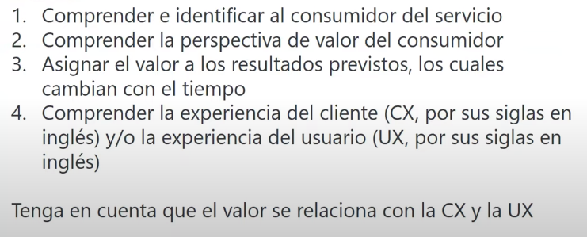
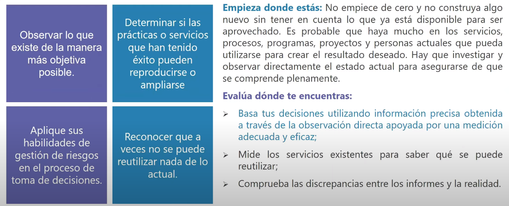
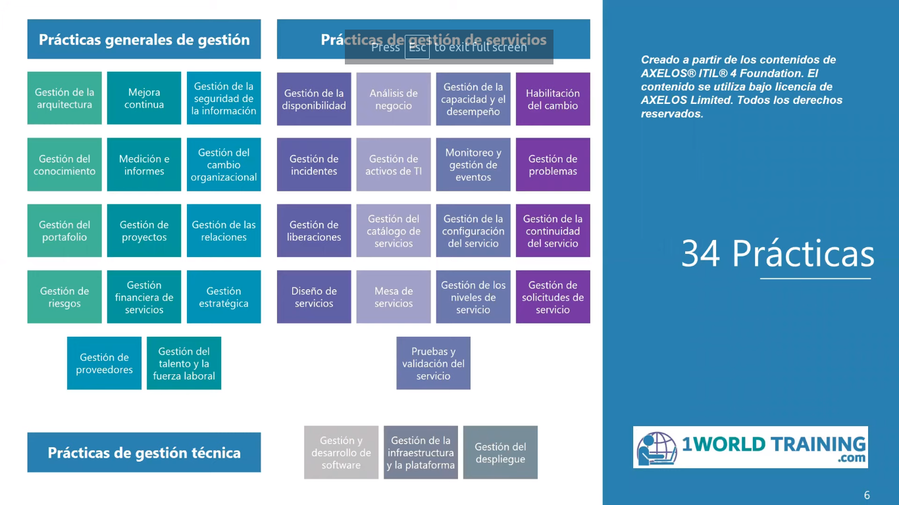
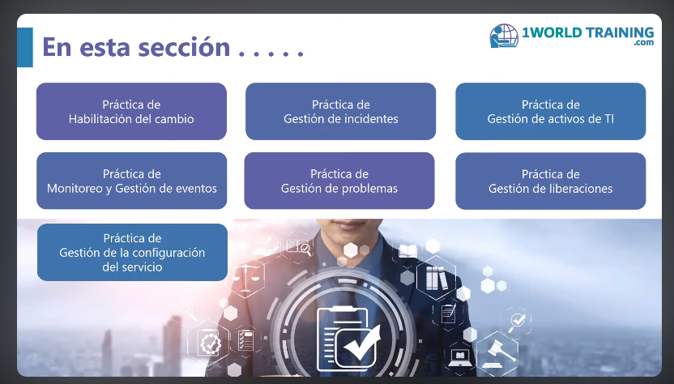
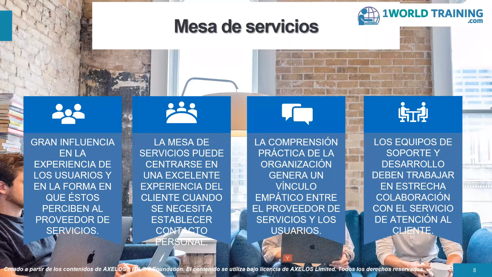
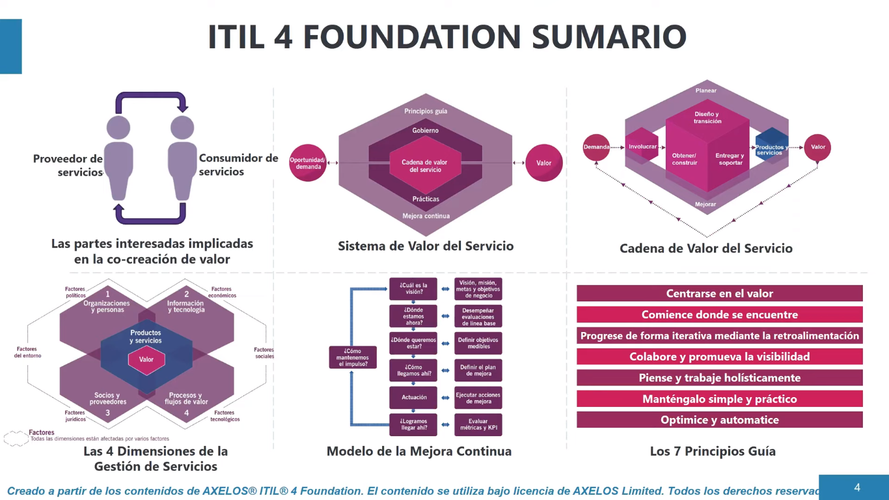

# ITIL V4

## GESTION DE SERVICIOS DE TI

### Conceptos claves de la gestion de servicios:

#### ¿Que es itil 4? :
* Es una guia integral para la gestion de servicios de ti en una economia digital.
* Son una serie de buenas practicas a seguir para poder implantar un sistema de gestion de serviios de ti.

#### ¿Que es la gestion de servicios?

* conjunto de capacidades o necesidades especializadas para ofrecer atencion y valor a los clinetes en forma de servicios.
* El concepto de valor es especialmente importante.
* Enfocarse en la creacion de valor para la parte consumidora principalmente.

#### Servicio de infraestructura informatica:
* el valor para el cliente proviene de los servicios ofrcidos. (Ej, gestion de BBDD, Gestion de seguridad, soluciones y gestiones de virtualizacion)

#### Valor  y cocreacion de valor:

#### 4 dimensiones de la gestion de servicios

* Dimension 1: Organizaciones y personas
* * Entender como esta estructurada y gestionada.
* * Comprender y aclarar los roles, responsabilidades y autoridades existentes.
* * En general aqui se tiene en cuenta: 
* * * Estructuras organizativas y formales
* * * Cultura
* * * Personal y competencias requeridas.
* * * Roles y responsabilidades

* Dimension 2: Informacion y tecnologia
* Dimension 3: Socios y proveedores
* Dimension 4: Flujos de valor y procesos.

#### 7 principios guia de itil 

Representan los elementos centrales de itil y de la gestion de servicios en general y sirven para tomar buenas decisiones en la organizacion.

##### Primer principio guia:
* Centrarse en el valor

Fuente: WorldTrainig.com

##### Segundo principio guia:
* Comience donde se encuentre

Fuente: WorldTrainig.com

##### Tercer principio guia:
* Progrese de forma iterativa mediante la retroalimentacion.

##### Cuarto principio guia:
* Piense y trabaje holisticamente.

##### Quinto principio guia:
* Colaborre y promueva la visibilidad.

##### Sexto principio guia:
* Mantengalo simple y practico

##### Septimo principio guia: 
* Optimice y automatice

##### Gobernanza 

accion o modelo de gobernar, es decir, proporcionar una guia o una norma a seguir en la organizacion. Evaluar y Reevaluar mientras que se supervisa el avance de cada uno. 

### Sistemas de valor del servicio:

Objetivo: que se cree valor continuamente por medio de la gestion de los servicios.

* conjunto de areas(agile, devops, etc) que se deben abordar para garantizar la genaracion de valor.

Entradas: oportunidad, demanda por parte de consumidores internos o externos.

### Mejora continua:

* Modelo de mejora continua de Itil: Guia para apoyarde en la mejroa de gestion de servicios.
* Se aplica a todos los productos, servicios y componentes.

1. Enfoque estructurado de la mejora continua.
2. integrar la mejora contiua en la cadena de valor.
3. Practicar la mejora continua que ayuda a mejorar a la organizacion.

pasos :

¿Cual es la vision?

* permite definir hacia donde ir.

¿Donde estamos ahora?

* enterder el avance entre el punto de partida 

¿Donde queremos estar?

¿Como llegamos ahi?

Actuar...

¿Logramos llegar ahi?

¿Como mantenemos este impulso?

#### Practicas

## MEJORA CONTINUA.

## Practicas de la gestion de servicios:

## Habilitacion del cambio: Deben ser evaluados y autorizados antes de ser desplegados.

* Tipos de cambios

* * Cambios normales: 
* * Cambios urgentes: 
* * Camios estandar: 

## Mesa de servicios: 

Objetivoc: Garantizar soporte y comunicacion.
presta servicios, tener en cuenta la valoracion del usuario,

## Practica de la gesion de despliegue

Enfoques de la gestion de despligue:

* despliegue por fases:
contar con un calendario de despliegue, y desplegar de manera controlada a un numero mayor de usuarios. con esto se gestiona mejor un despligue y se controlan los daños que puede causar un despliegue fallido a gran escala.

* Entrega continua:  

* despliegue tipo bigbang: se utiliza ese enfoque cuando una nueva version es inconsistente o no es compatible con las versiones antiguas

* despligue mediante extraccion: se colocan en algun sitio y los usuario las descargan cuando las necesiten.

Resumen:

ITIL 4 (Information Technology Infrastructure Library) es un marco de mejores prácticas diseñado para la gestión de servicios de tecnologías de la información (ITSM, por sus siglas en inglés). Proporciona un conjunto de directrices y procesos para ayudar a las organizaciones a mejorar la eficiencia, la eficacia y la entrega de servicios de TI de alta calidad.

Aquí hay un resumen de los puntos clave de ITIL 4:

1. **Enfoque en el Valor del Servicio:**
   ITIL 4 adopta un enfoque centrado en el valor del servicio, reconociendo la importancia de entregar servicios que satisfagan las necesidades y expectativas del cliente.

2. **Ciclo de Vida del Servicio:**
   Define un ciclo de vida del servicio que abarca desde la estrategia hasta la mejora continua, proporcionando un marco completo para la planificación, entrega y mejora de servicios de TI.

3. **Principios Guiding:**
   Introduce siete principios guía que ayudan a las organizaciones a adoptar y adaptar ITIL para sus necesidades específicas.

4. **Modelo de Sistema de Valor de Servicio (SVS):**
   Proporciona un modelo que representa cómo todos los componentes y actividades de la organización trabajan juntos para facilitar la creación y el suministro de servicios de TI.

5. **Prácticas de Gestión de Servicios:**
   Define un conjunto de prácticas de gestión de servicios que se pueden adaptar para abordar situaciones y requisitos específicos de la organización.

6. **Continual Improvement (Mejora Continua):**
   Enfatiza la importancia de la mejora continua en todos los aspectos de la prestación de servicios, fomentando un ciclo constante de revisión y optimización.

7. **Flexibilidad y Adaptabilidad:**
   ITIL 4 se diseñó para ser más ágil y adaptable, permitiendo a las organizaciones integrar prácticas ágiles y DevOps en sus operaciones de gestión de servicios.

8. **Incorporación de la Transformación Digital:**
   Reconoce la importancia de la transformación digital y cómo ITIL 4 puede ser parte de ese proceso, proporcionando orientación para la adopción de nuevas tecnologías y prácticas.

ITIL 4 es la evolución del marco ITIL v3 y está diseñado para ser más flexible y centrado en el valor, adaptándose a los cambios en la tecnología y las necesidades comerciales modernas. Es utilizado por organizaciones en todo el mundo para mejorar sus capacidades de gestión de servicios de TI.

